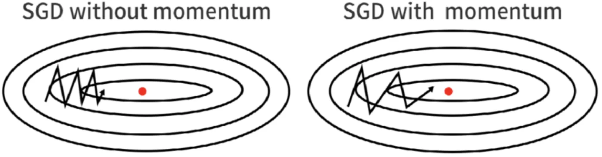

# Task G — Optimizers: SGD and Adam

Once a backward pass has filled in the gradient of the loss with respect to every parameter, something has to actually change the parameters. That job belongs to the **optimizer**. The model owns the layers and their parameters; the optimizer owns the *update rule* — the recipe that turns gradients into parameter changes — and the learning rate.

Keeping these two concerns separate means you can swap update rules without touching the model, exactly as PyTorch lets you choose between `torch.optim.SGD`, `torch.optim.Adam`, and others. In this task you implement the update rule for two optimizers: plain stochastic gradient descent (with momentum, Nesterov momentum, and weight decay) and Adam.

---

## The Optimizer Object

An optimizer is constructed from the parameters it is responsible for:

```python
optimizer = SGD(model.parameters(), lr=0.1)
```

`model.parameters()` yields an iterable of `(parameter, gradient)` pairs. Each pair is two NumPy arrays that live *inside* a layer: the parameter (for example a weight matrix `W`) and the gradient buffer that `backward` writes into (`dW`). The optimizer stores these pairs in `self.parameters` and keeps the references for its whole lifetime.

This is the key contract to understand: the optimizer never makes its own copy of a parameter or a gradient. It holds the *same array objects* the layers hold. When `backward` writes new gradients in place, the optimizer sees them automatically. When the optimizer updates a parameter in place, the layer sees the new value automatically. Because of this, **every update inside `step` must modify the array in place** — use `param -= ...`, not `param = param - ...`. The second form would create a new array and silently break the link to the layer.

The optimizer exposes two methods, both called from the training loop:

- `optimizer.zero_grad()` — clears every gradient buffer to zero.
- `optimizer.step()` — applies one update to every parameter.

A typical training step reads:

```python
optimizer.zero_grad()
logits  = model(x)
loss    = loss_fn(logits, y)
dlogits = loss_fn.backward()
model.backward(dlogits)        # fills the gradient buffers
optimizer.step()               # consumes them, updates the parameters
```

The constructors and `zero_grad` are **provided**. You implement only the `step` method of each optimizer. The constructor has already created any extra buffers `step` needs (described below), so you can read them off `self`.

---

## Vanilla SGD

The simplest update rule moves each parameter a small step in the direction that decreases the loss — the opposite of the gradient:

```
param -= lr * grad
```

`lr` (the learning rate) controls the step size. Too small and training crawls; too large and the steps overshoot and training becomes unstable. This is the update you get when `momentum` is `0`.

---

## Momentum

Plain SGD treats every mini-batch independently, so its path toward a minimum can zig-zag: noisy gradients push it back and forth across narrow valleys. **Momentum** smooths this out by accumulating a running average of past gradients, called the *velocity*, and stepping along the velocity instead of the raw gradient:

```
v = β * v + grad
param -= lr * v
```

`β` (the `momentum` coefficient, typically `0.9`) sets how much of the previous velocity carries over. Intuitively, the velocity behaves like a heavy ball rolling downhill: it builds up speed in directions where the gradient consistently points the same way, and it cancels out directions that keep flipping sign.


*Source: [ml-explained.com](https://ml-explained.com/blog/gradient-descent-explained)*

The velocity is one array per parameter, all initialized to zero. The constructor has already created them in `self._velocities`, lined up with `self.parameters` in the same order. Update each velocity **in place** (`v *= β` then `v += grad`) so the running average persists across calls to `step`.

---

## Nesterov Momentum

Nesterov momentum is a small refinement. Instead of measuring the gradient at the current position and then stepping with the velocity, it looks slightly *ahead* — in the direction the velocity is about to carry the parameter — and corrects the update there. In this implementation it works out to:

```
v = β * v + grad
param -= lr * (grad + β * v)
```

The velocity update is identical to plain momentum; only the final step direction changes, from `v` to `grad + β * v`. In practice Nesterov often converges a little faster and more stably than plain momentum. It is selected by the `nesterov` flag, and it requires `momentum > 0` (the provided constructor already rejects `nesterov=True` with `momentum=0`).

---

## Weight Decay

Large parameter values are a common symptom of overfitting. **Weight decay** discourages them by adding a penalty proportional to the size of each parameter. Concretely, before the momentum logic runs, it adds a multiple of the parameter itself to the gradient:

```
grad ← grad + weight_decay * param
```

This is the same thing as L2 regularization: it nudges every parameter a little toward zero on each step, with `weight_decay` controlling the strength. When `weight_decay` is `0` (the default) this term vanishes and the update is unchanged. This matches the coupled weight decay in `torch.optim.SGD` (it is *not* the decoupled AdamW variant).

> **Do not modify the gradient buffer in place here.** The `grad` array is shared with the layer that produced it. If you wrote `grad += weight_decay * param`, you would corrupt the layer's stored gradient. Instead bind a new local array, `grad = grad + weight_decay * param`, and use that for the rest of the step. The original buffer stays untouched, preserving the reference contract described above.

The same caution applies to the Adam `step`.

---

## The Adam Optimizer

Adam ("adaptive moment estimation") is the optimizer most modern networks are trained with. SGD uses a single learning rate for every parameter; Adam instead adapts the effective step size *per parameter*, using the recent history of each parameter's gradients. It tracks two running averages for every parameter:

- the **first moment** `m` — an exponential moving average of the gradients (like momentum), and
- the **second moment** `v` — an exponential moving average of the *squared* gradients (a measure of how large that parameter's gradients have been).

Each step (with `t` counting how many steps have been taken so far):

```
m = β1 * m + (1 - β1) * grad
v = β2 * v + (1 - β2) * grad²

m_hat = m / (1 - β1ᵗ)        # bias correction
v_hat = v / (1 - β2ᵗ)

param -= lr * m_hat / (sqrt(v_hat) + eps)
```

The division by `sqrt(v_hat)` is what makes the step adaptive: parameters with consistently large gradients take smaller steps, and parameters with small gradients take larger ones. The `m_hat`/`v_hat` rescaling is **bias correction** — because `m` and `v` start at zero, the early averages are biased toward zero, and dividing by `(1 - βᵗ)` undoes that. `eps` is a tiny constant that keeps the denominator from being zero. Weight decay, if set, is applied to the gradient first, exactly as in SGD.

You do not need to derive any of this. The defaults (`β1 = 0.9`, `β2 = 0.999`, `eps = 1e-8`) are the standard ones and rarely need changing. The provided constructor stores `self.beta1`, `self.beta2`, `self.eps`, `self.weight_decay`, the step counter `self.t`, and the per-parameter buffers `self._m` and `self._v` (both initialized to zero, lined up with `self.parameters`). Your `step` increments `self.t` and applies the update above, updating `m` and `v` in place.

---

## What to Implement

`SGD` lives in `src/optim/sgd.py` and `Adam` lives in `src/optim/adam.py`; both inherit from `Optimizer` in `src/optim/optimizer.py`. Everything except the two `step` methods is provided.

#### `SGD.step(self) -> None`

Apply one update to every `(param, grad)` pair in `self.parameters`, using its matching velocity in `self._velocities`. For each pair:

1. If `self.weight_decay != 0`, add `self.weight_decay * param` to the gradient — into a **new local** array, not the shared buffer.
2. If `self.momentum != 0`, update the velocity in place (`v *= self.momentum`, then `v += grad`) and choose the step direction:
   - Nesterov (`self.nesterov` is `True`): `grad + self.momentum * v`.
   - Plain momentum: `v`.
   - If `self.momentum == 0`, the step direction is just `grad`.
3. Update the parameter in place: `param -= self.lr * <step direction>`.

#### `Adam.step(self) -> None`

1. Increment `self.t`.
2. Compute the two bias-correction denominators, `1 - self.beta1 ** self.t` and `1 - self.beta2 ** self.t`, once per call.
3. For each `(param, grad)` pair with its matching `m` in `self._m` and `v` in `self._v`:
   - If `self.weight_decay != 0`, add `self.weight_decay * param` to the gradient (new local array, as above).
   - Update `m` and `v` in place per the equations.
   - Form `m_hat` and `v_hat` using the bias-correction denominators.
   - Update the parameter in place: `param -= self.lr * m_hat / (np.sqrt(v_hat) + self.eps)`.

**Constraints**

- Parameters and the momentum/moment buffers must be updated **in place**.
- Never write into the shared `grad` buffer; the weight-decay term goes into a fresh local array.
- NumPy only — no autograd libraries.

---

## Deliverables

- Implement `SGD.step` in `src/optim/sgd.py` and `Adam.step` in `src/optim/adam.py`.
- Run `make test-g` and confirm the smoke tests pass.
- Run `make submit-g` to generate `submission.json` and upload it on the course webpage.
